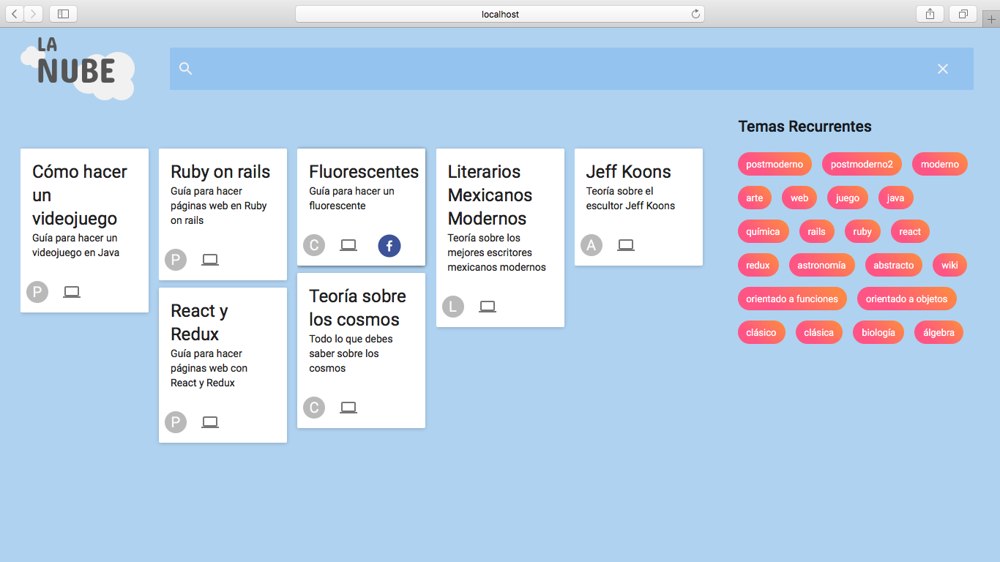
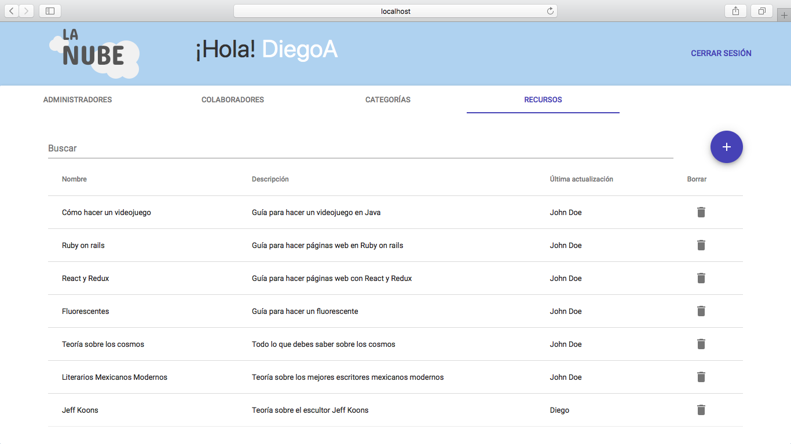
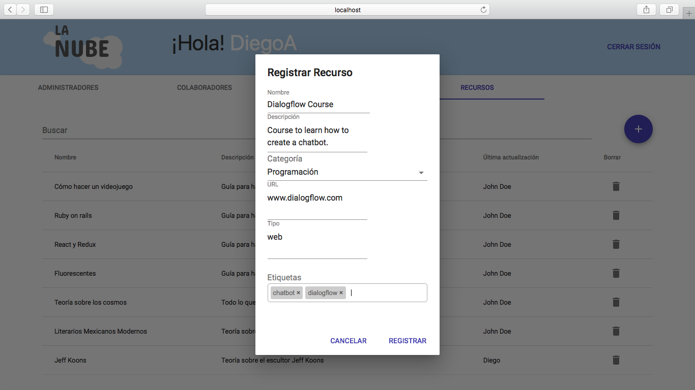

# LaNube

Technologies: ReactJS, Redux, Webpack, TypeScript, NodeJS, MongoDB, MaterialUI. 

Description:La Nube is an web app where teachers and students can show educational projects developed by the students of Computer Science from ITESM. The web app allows to have two type of users: administrators and collaborators; both users can add resources to the web app.Each resource has a link to the site where it is hosted and we provide a link to share it on Facebook.

This project was developed by the team:
- Natalia G.
- Myriam G.
- Fabian M.
- Diego AJV

The project:

